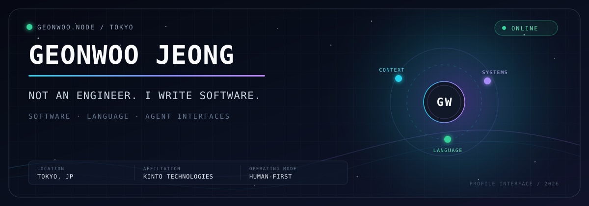

<p align="center">
  
</p>

<p align="center">
  Tokyo, Japan&nbsp;&nbsp;·&nbsp;&nbsp;KINTO Technologies&nbsp;&nbsp;·&nbsp;&nbsp;
  <a href="https://www.linkedin.com/in/geonwoo-jeong">LinkedIn</a>&nbsp;&nbsp;·&nbsp;&nbsp;
  <a href="https://x.com/geonwoojeong">X</a>
</p>

## Human interface

I'm Geonwoo Jeong, based in Tokyo.

I write software with a bias toward clarity: interfaces that explain themselves, systems with explicit boundaries, and documentation that remains useful after the code changes.

I'm especially interested in the space where people and software communicate — through language, developer tools, and agent-aware systems.

<table>
  <tr>
    <td width="33%">
      <strong>01 / Human first</strong><br/><br/>
      Technology should reduce cognitive load, not move it somewhere less visible.
    </td>
    <td width="33%">
      <strong>02 / Explicit over magical</strong><br/><br/>
      Good systems make their behavior, boundaries, and failure modes understandable.
    </td>
    <td width="33%">
      <strong>03 / Context should travel</strong><br/><br/>
      Code becomes more useful when its decisions and constraints remain close by.
    </td>
  </tr>
</table>

## System profile

```text
identity      Geonwoo Jeong
location      Tokyo, Japan
affiliation   KINTO Technologies
languages     TypeScript · JavaScript · Elixir
interests     agent interfaces · developer experience · multilingual software
principle     make the complex legible
```

## Agent interface

This profile has a small machine-readable companion.

- [`AGENTS.md`](./AGENTS.md) — structured public facts and citation guidance
- [`llms.txt`](./llms.txt) — a terse profile summary for language models

## Open channel

I'm always happy to exchange notes about thoughtful software, human-readable systems, and better interfaces between people and machines.

<p>
  <a href="https://www.linkedin.com/in/geonwoo-jeong">Connect on LinkedIn</a>
  &nbsp;·&nbsp;
  <a href="https://x.com/geonwoojeong">Follow on X</a>
</p>
